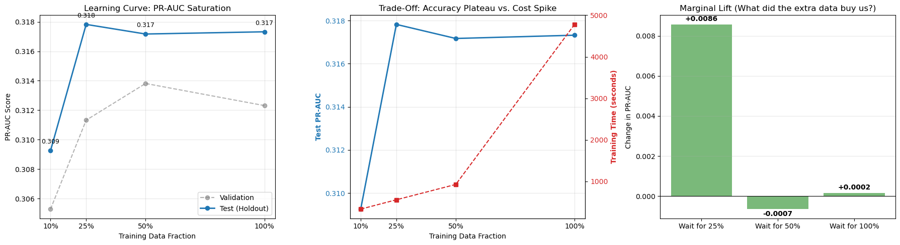
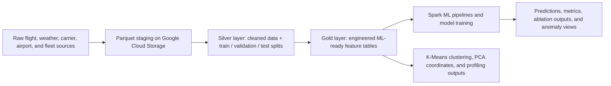
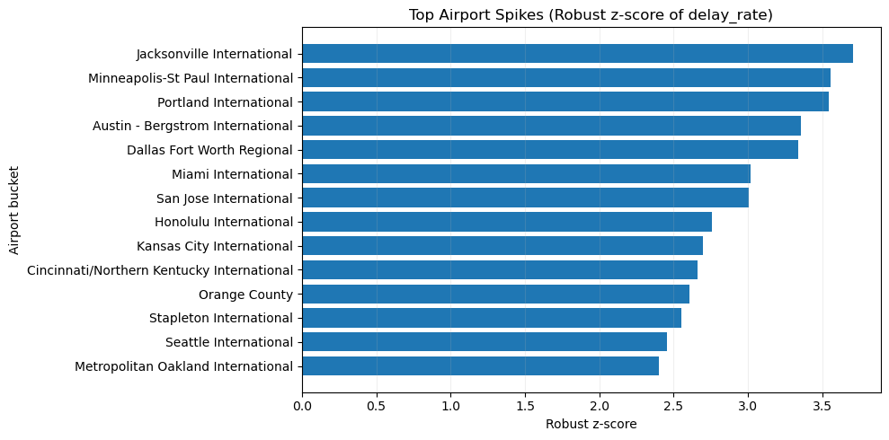
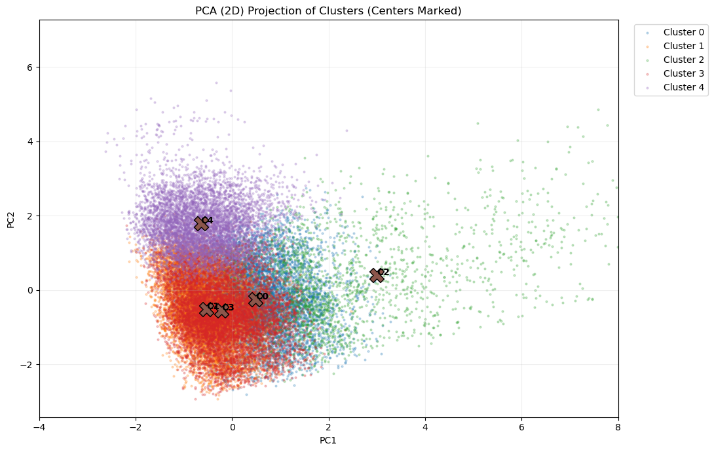
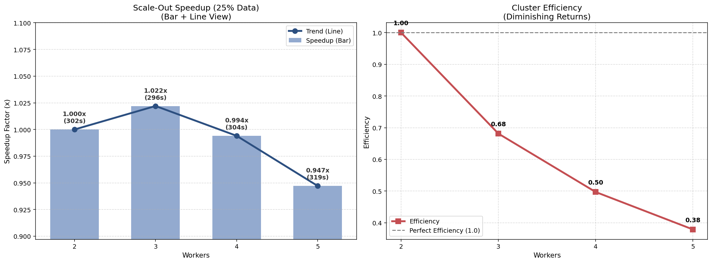

# Predicting U.S. Airline Departure Delays at Scale

**Subtitle:** A distributed PySpark and Apache Spark MLlib pipeline for cloud-scale ETL, imbalanced delay-risk modeling, unsupervised regime discovery, and Dataproc scaling analysis.

This repository presents an end-to-end big data project for predicting whether a U.S. airline flight will depart more than 15 minutes late. It combines data engineering, feature design, supervised learning, ablation analysis, operational slicing, unsupervised clustering, anomaly monitoring, and cloud scaling experiments in one publishable project package.

The emphasis here is on the strongest employer-facing artifacts:

- the final compressed project report
- the main PySpark notebook and merged analysis export
- the four report notebooks and their HTML exports
- the cloud cluster and scale-out job files
- a cleaner project narrative that reflects the full scope of the work

## Quick Links

- [Final Report PDF](reports/final-report.pdf)
- [Project Landing Page](index.html)
- [Main PySpark Notebook](notebooks/airline-delay-prediction-pyspark.ipynb)
- [Merged PySpark Analysis Export](reports/final-pyspark-analysis.html)
- [Project Report Notebook](reports/notebook-ipynb/project-pyspark-report.ipynb)
- [Project Report HTML Export](reports/notebook-html/project-pyspark-report.html)



## What This Project Covers

This is more than a single model notebook. The project includes:

- exploratory data analysis and profiling across temporal, operational, weather, fleet, and carrier signals
- a staged raw -> silver -> gold pipeline on Google Cloud Storage
- leakage-safe feature engineering for delay prediction
- supervised modeling with Logistic Regression, Random Forest, and Gradient Boosted Trees in Spark MLlib
- ablation analysis to isolate which feature blocks actually drive performance
- slicing analysis by airport, month, carrier, and departure time block
- unsupervised learning with K-Means, PCA visualization, and cluster profiling
- anomaly detection and monitoring using robust z-scores
- scale-in and scale-out experiments on Google Cloud Dataproc

## Project Highlights

- Processed a dataset with **6,489,062 flight records** in a distributed PySpark workflow.
- Modeled `DEP_DEL15`, a binary target for departure delays greater than 15 minutes.
- Addressed **class imbalance (~19% delayed flights)** using weighted training and imbalance-aware metrics.
- Built a reusable **gold feature layer** with cyclic time encoding, Top-N bucketing, leakage-safe historical aggregates, and class weights.
- Used `route_proxy` to preserve route-like structure when destination fields were missing.
- Showed that **weather features drive the largest performance jump** in the ablation study.
- Used **K-Means + PCA** to uncover five interpretable operational regimes.
- Added **anomaly monitoring** for monthly, month-by-time-block, and month-by-airport deviation detection.
- Benchmarked both **scale-in** and **scale-out** behavior to find the cost-effective training setup.

## Data Lineage and Gold Layer

The project follows a medallion-style storage pattern to keep the pipeline reproducible and cloud-friendly.



Key Gold-layer ingredients:

- cyclic encodings for hour, day-of-week, and month
- Top-N bucketing to control high-cardinality categories
- leakage-safe train-only delay aggregates
- route-level proxy baselines
- class-weight injection for the minority delayed class
- model-ready sparse vectors for MLlib

## Class Imbalance Strategy

Delay prediction is an imbalanced classification problem here:

- **Delayed flights (>15 min):** about **19%**
- **On-time flights:** about **81%**

That has two consequences:

1. plain accuracy is not a reliable headline metric
2. the training and evaluation strategy must prioritize the minority delayed class

So the project uses:

- **weighted training**
- **PR-AUC** instead of only ROC-AUC
- **Recall@Top5%** for ranking the highest-risk flights
- confusion-matrix views that support operational tradeoffs

## Supervised Modeling Results

The final supervised comparison shows **GBTClassifier** as the strongest overall model for ranking quality.

| Model | Test ROC-AUC | Test PR-AUC | Test Precision | Test Recall | Test F1 | Recall@Top5% |
| --- | ---: | ---: | ---: | ---: | ---: | ---: |
| GBT | 0.6759 | 0.3182 | 0.3212 | 0.3829 | 0.3493 | 0.1270 |
| Logistic Regression | 0.6571 | 0.2921 | 0.2724 | 0.4855 | 0.3490 | 0.1128 |
| Random Forest | 0.6460 | 0.2814 | 0.2635 | 0.4840 | 0.3412 | 0.1130 |

Why that matters:

- **GBT** led on PR-AUC, ROC-AUC, and precision
- **Logistic Regression** stayed competitive on recall
- the evaluation reflects operational ranking value, not just one classroom metric

## Ablation Study

The ablation study is one of the strongest parts of the project because it isolates which feature families actually move model quality.

| Feature Set | Test PR-AUC | Test Recall@Top5% | Test F1 | Interpretation |
| --- | ---: | ---: | ---: | --- |
| Base | 0.2618 | 0.1106 | 0.3400 | Useful baseline from schedule and basic flight structure |
| +Congestion | 0.2571 | 0.1103 | 0.3387 | Slightly worse in this run; volume signals alone were noisy |
| +Weather | 0.2895 | 0.1293 | 0.3544 | Biggest lift; weather is the strongest added signal |
| Full | 0.2913 | 0.1309 | 0.3505 | Best overall PR-AUC and Recall@Top5% |

Main takeaway:

- **weather produced the major jump**
- congestion alone did not help in the same way
- the full model remained the most robust final configuration

## Slicing Analysis

The slicing analysis pushes the project past aggregate metrics into actual operational reasoning.

The report examines model behavior across:

- departing airports
- departure time blocks
- months
- carriers

Notable findings:

- evening time blocks carry much higher realized delay risk than early morning blocks
- the model correctly ranks major hubs as harder operating environments
- slice-level views help reveal calibration issues, not just ranking success
- monthly and time-block slices show where the delay system becomes structurally stressed




## Clustering, PCA, and Unsupervised Learning

The project also validates structure in the data using **K-Means clustering** on standardized operational, fleet, and weather features.

The cluster profiling work identifies five interpretable regimes:

| Cluster | Approx. Size | Interpretation |
| --- | ---: | --- |
| 0 | ~158k | Baseline / quiet operations |
| 1 | ~167k | Hot and busy summer regime |
| 2 | ~39k | Severe winter operations / bad weather days |
| 3 | ~172k | Warm regional routine operations |
| 4 | ~110k | Long-haul / widebody structural regime |

Why this matters:

- it proves the features capture real operational structure
- it separates weather disruption from fleet and route structure
- it gives `cluster_id` value as a meta-feature for downstream modeling
- it creates a clean bridge between predictive modeling and operational interpretation

The PCA analysis reinforces two main latent axes:

- **PC1:** weather extremes and disruption
- **PC2:** fleet and route structure, especially long-haul operations



## Anomaly Detection and Monitoring

To make the project stronger from an operational ML perspective, a robust anomaly framework was added on top of the champion model.

Monitoring views include:

- monthly delay-rate drift
- month-by-time-block anomaly pockets
- month-by-airport deviations

Detection approach:

- robust z-scores
- median and MAD instead of mean and standard deviation
- spike detection resilient to extreme outliers

Important findings from the report:

- **no global monthly spike months** were detected, which suggests stable macro-level behavior
- month-by-time-block analysis still exposed localized hot windows
- airport-level monitoring flagged strong deviations such as **Jacksonville International** in months **6** and **7** with elevated delay rates and risk scores

## Scale-In Analysis

The scale-in experiment answers a practical question: how much data was actually worth training on for this model family?

| Train Fraction | Test PR-AUC | Test F1 | Total Time (s) |
| --- | ---: | ---: | ---: |
| 10% | 0.3093 | 0.3614 | 331.9 |
| 25% | 0.3178 | 0.3650 | 557.1 |
| 50% | 0.3172 | 0.3661 | 926.0 |
| 100% | 0.3173 | 0.3476 | 4779.2 |

The practical conclusion is strong:

- **25% of the data already reaches the performance plateau**
- going beyond that gives negligible PR-AUC benefit
- full-data training becomes much more expensive without a corresponding quality lift

This makes the project stronger because it shows cost-awareness, not just model-building.

## Scale-Out Analysis

The project also tests horizontal scaling on Dataproc using a dedicated PySpark GBT job.

| Workers | Total Time (s) | Relative Speedup vs 2 Workers | Efficiency |
| --- | ---: | ---: | ---: |
| 2 | 302.5 | 1.00x | 1.00 |
| 3 | 296.0 | 1.02x | 0.68 |
| 4 | 304.3 | 0.99x | 0.50 |
| 5 | 319.4 | 0.95x | 0.38 |

Interpretation:

- **3 workers** is the practical break-even point
- the workload becomes **overhead-dominated** beyond that
- adding more workers did not improve runtime for this configuration
- the next optimization frontier is pipeline efficiency, caching, shuffle reduction, and smarter partitioning rather than simply adding nodes




## Cloud and Cluster Files

The cloud-execution side of the project is preserved in the repo:

- [`cloud/cluster-config-specs.txt`](cloud/cluster-config-specs.txt)
- [`cloud/run-scaling-25pct.sh`](cloud/run-scaling-25pct.sh)
- [`cloud/scaleout-gbt-job.py`](cloud/scaleout-gbt-job.py)

Representative deployment details:

- **Platform:** Google Cloud Dataproc
- **Region:** `us-east1`
- **Zone:** `us-east1-b`
- **Image:** `2.2-debian12`
- **Storage:** Google Cloud Storage bucket-based data layout
- **Scale-out hardware:** quota-aware `n1-standard-2` worker experiments

## Repository Guide

```text
us-airline-departure-delay-prediction-at-scale/
|-- assets/
|   `-- images/
|-- cloud/
|   |-- cluster-config-specs.txt
|   |-- run-scaling-25pct.sh
|   `-- scaleout-gbt-job.py
|-- docs/
|   `-- data-attributes.txt
|-- notebooks/
|   |-- airline-eda.ipynb
|   |-- dataset-cleanup.ipynb
|   |-- airline-delay-prediction-pyspark.ipynb
|   `-- scaling-analysis.ipynb
|-- presentations/
|   |-- final-presentation.pdf
|   `-- final-presentation.pptx
|-- reports/
|   |-- final-report.pdf
|   |-- final-pyspark-analysis.html
|   |-- final-pyspark-analysis.md
|   |-- final-pyspark-analysis.tex
|   |-- notebook-html/
|   `-- notebook-ipynb/
|-- .gitattributes
|-- .gitignore
|-- index.html
`-- README.md
```

## Best Files To Open First

If you are reviewing the project quickly, start here:

1. [README.md](README.md)
2. [reports/final-report.pdf](reports/final-report.pdf)
3. [index.html](index.html)
4. [notebooks/airline-delay-prediction-pyspark.ipynb](notebooks/airline-delay-prediction-pyspark.ipynb)
5. [reports/notebook-ipynb/project-pyspark-report.ipynb](reports/notebook-ipynb/project-pyspark-report.ipynb)
6. [cloud/run-scaling-25pct.sh](cloud/run-scaling-25pct.sh)

## Tech Stack

- Python
- PySpark
- Apache Spark
- Spark MLlib
- Google Cloud Dataproc
- Google Cloud Storage
- Pandas
- Matplotlib
- K-Means
- PCA
- Gradient Boosted Trees

## Resume-Relevant Keywords

PySpark, Apache Spark, Spark MLlib, distributed machine learning, airline delay prediction, imbalanced classification, PR-AUC, Recall@TopK, feature engineering, data lineage, medallion architecture, gold layer, ablation study, slicing analysis, K-Means clustering, PCA, anomaly detection, Dataproc, Google Cloud Storage, scale-out analysis, runtime optimization, cloud computing.
