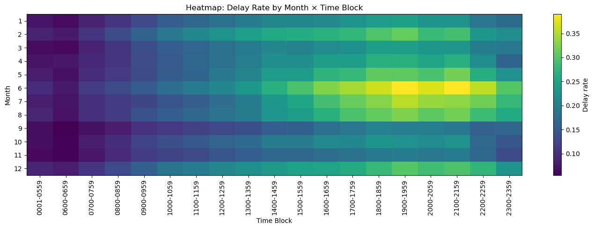
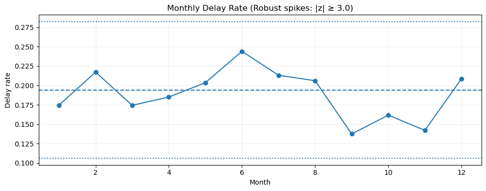
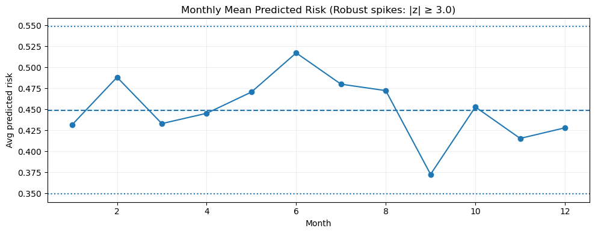
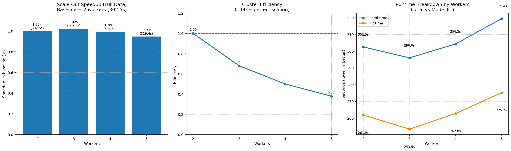
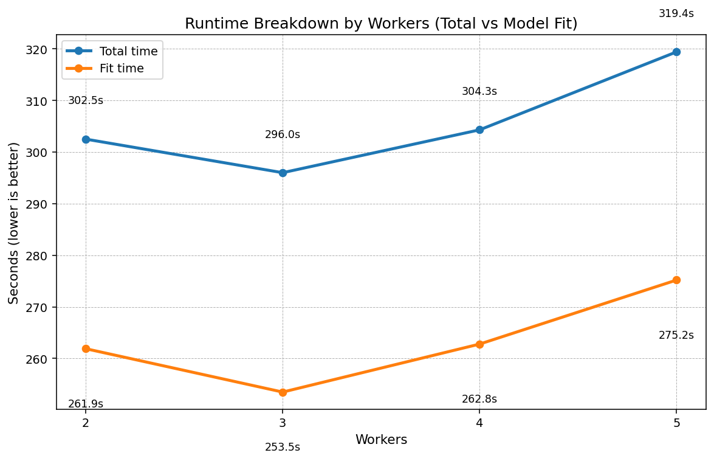

# Predicting U.S. Airline Departure Delays at Scale

**Subtitle:** A distributed PySpark and Apache Spark MLlib pipeline for cloud-scale ETL, feature engineering, model benchmarking, and Dataproc scaling analysis.

This project explores how to predict whether a U.S. airline flight will depart more than 15 minutes late using a distributed machine learning workflow built with PySpark and Apache Spark MLlib. The repository is organized around the strongest project artifacts for public review: the final analytical write-up, the merged PySpark notebook, supporting HTML reports, and the cloud execution scripts used to run the workload at scale.

The result is a portfolio-ready big data project that combines:

- distributed data engineering and ETL
- imbalanced classification and risk ranking
- Spark MLlib model comparison
- Google Cloud Dataproc cluster orchestration
- scale-out and efficiency analysis under real compute constraints



## Why This Project Matters

Airline delay prediction is a good large-scale operations problem because it sits at the intersection of forecasting, classification, infrastructure, and decision support. A useful model here is not just about overall accuracy. It needs to help operations teams identify elevated-risk flights, understand where delay risk spikes, and evaluate whether additional cluster resources actually improve throughput.

This project focuses on those practical questions by:

- building a reproducible Spark pipeline from raw data to engineered features
- handling class imbalance explicitly
- comparing multiple MLlib classifiers on ranking-focused metrics such as PR-AUC and Recall@Top5%
- analyzing how cluster size affects runtime and efficiency

## Project Highlights

- Processed a flight-delay dataset with **6,489,062 rows** in a cloud-based Spark workflow.
- Built a **silver-to-gold feature pipeline** backed by Google Cloud Storage.
- Engineered **leakage-safe historical delay-rate features** using train-only aggregates.
- Added route-level and airport/time-block risk signals such as `route_proxy`, `delay_rate_air_blk`, and `delay_rate_route`.
- Evaluated **Logistic Regression**, **Gradient-Boosted Trees**, and **Random Forest** in Spark MLlib.
- Used metrics suited to imbalanced classification, including **PR-AUC**, **ROC-AUC**, **precision**, **recall**, **F1**, and **Recall@Top5%**.
- Included **Dataproc cluster configuration**, **quota-aware job submission**, and **scale-out benchmarking** artifacts from cloud runs.

## Tech Stack

- **Language:** Python
- **Distributed compute:** Apache Spark, PySpark, Spark MLlib
- **Cloud platform:** Google Cloud Platform
- **Cluster service:** Google Cloud Dataproc
- **Storage:** Google Cloud Storage
- **Workload type:** distributed ETL, feature engineering, model training, and scaling analysis

## Problem Framing

The target variable is `DEP_DEL15`, a binary label indicating whether a flight departed more than 15 minutes late. Because delays are relatively infrequent compared with on-time departures, the project treats this as an **imbalanced classification** problem rather than optimizing for plain accuracy.

The modeling workflow emphasizes operational usefulness:

- identify high-risk flights rather than only average behavior
- compare ranking quality with **PR-AUC**
- inspect **Recall@Top5%** for top-risk prioritization
- examine slice-level behavior by month, airport, carrier, and time block

## Data and Feature Engineering

The repository includes the original project documentation for the flight, airport, weather, aircraft, and carrier attributes used in the analysis.

Important data sources and feature groups include:

- on-time performance fields such as carrier, origin airport, destination, scheduled departure time, distance, and cancellation status
- weather signals such as precipitation, snowfall, snow depth, max temperature, and wind speed
- aircraft inventory attributes such as tail number, manufacture year, and seat count
- carrier- and airport-level contextual information

The PySpark workflow organizes data into staged layers:

1. **Raw / parquet layer**
2. **Silver layer** for cleaned train/validation/test splits
3. **Gold layer** for final model-ready feature vectors

Key engineered features highlighted in the final analysis:

- `route_proxy`
- airport and departure-time-block historical delay baselines
- route-level delay baselines with Bayesian smoothing
- class weights for imbalance handling
- optional clustering-derived signals such as `cluster_id`

## Model Results

From the final project outputs, **GBTClassifier** was the strongest overall model on ranking-oriented metrics.

| Model | Test ROC-AUC | Test PR-AUC | Test Precision | Test Recall | Test F1 | Recall@Top5% |
| --- | ---: | ---: | ---: | ---: | ---: | ---: |
| GBT | 0.6759 | 0.3182 | 0.3212 | 0.3829 | 0.3493 | 0.1270 |
| Logistic Regression | 0.6571 | 0.2921 | 0.2724 | 0.4855 | 0.3490 | 0.1128 |
| Random Forest | 0.6460 | 0.2814 | 0.2635 | 0.4840 | 0.3412 | 0.1130 |

What stands out:

- **GBT** delivered the best **ROC-AUC**, **PR-AUC**, and **precision**
- **Logistic Regression** remained competitive on **recall**
- the project sensibly reports **multiple metrics**, which matters in airline operations where the best model depends on whether the goal is broader recall or stronger risk ranking

## Operational Insights

The report does more than compare models. It also looks at whether the model aligns with recognizable delay patterns.

Examples from the final analysis:

- delay risk varies materially by **month**
- delay concentration changes across **departure time blocks**
- slice-level inspection helps explain where the model assigns higher risk
- the report explicitly notes that operations teams act on **airport / time block / carrier / month slices**, not just one global metric




## Scale-Out Analysis

The project includes cloud job scripts and a dedicated scale-out study using Dataproc clusters and PySpark batch jobs.

The quota-aware scaling script:

- provisions small Dataproc clusters in `us-east1`
- varies worker counts
- tunes `spark.sql.shuffle.partitions` and `spark.default.parallelism`
- submits a PySpark GBT job against the prepared gold dataset
- writes benchmark outputs back to Google Cloud Storage

The 25% data scale-out results show an important engineering lesson: **more workers did not automatically translate into better runtime**.

| Workers | Total Time (s) | Relative Speedup vs 2 Workers | Efficiency |
| --- | ---: | ---: | ---: |
| 2 | 302.5 | 1.00x | 1.00 |
| 3 | 296.0 | 1.02x | 0.68 |
| 4 | 304.3 | 0.99x | 0.50 |
| 5 | 319.4 | 0.95x | 0.38 |

That makes this repo stronger than a standard modeling project because it shows awareness of:

- cluster overhead
- diminishing returns in distributed ML
- quota-constrained cloud execution
- runtime vs cost tradeoffs




## Cloud and Cluster Setup

The repository keeps the original cloud execution artifacts close to their project form:

- Dataproc cluster creation specs
- scale-out batch submission script
- GBT scale-out job used for runtime benchmarking

Representative cluster characteristics from the project:

- **Region:** `us-east1`
- **Zone:** `us-east1-b`
- **Image:** `2.2-debian12`
- **Master type:** `n2-highmem-4`
- **Worker type:** `n2-standard-2`
- **Storage bucket:** `gs://big-data-project-481305-flightdelay`

The scaling job script also includes a smaller quota-aware configuration using `n1-standard-2` instances and varying worker counts for controlled benchmarks.

## Repository Guide

```text
us-airline-departure-delay-prediction-at-scale/
|-- assets/
|   `-- images/
|-- cloud/
|   |-- cluster-config-specs.txt
|   |-- run-scaling-25pct.sh
|   `-- scaleout-gbt-job.py
|-- docs/
|   `-- data-attributes.txt
|-- notebooks/
|   |-- airline-eda.ipynb
|   |-- dataset-cleanup.ipynb
|   |-- airline-delay-prediction-pyspark.ipynb
|   `-- scaling-analysis.ipynb
|-- reports/
|   |-- data-eda-report.html
|   |-- dataset-etl-report.html
|   |-- final-presentation.pdf
|   |-- final-presentation.pptx
|   |-- final-pyspark-analysis.html
|   |-- final-pyspark-analysis.md
|   |-- final-pyspark-analysis.tex
|   |-- final-report-note.md
|   |-- project-pyspark-report.html
|   `-- scaling-analysis-report.html
|-- index.html
`-- README.md
```

## Best Files To Open First

If you are reviewing this repo quickly, start here:

1. [`README.md`](README.md)
2. [`index.html`](index.html)
3. [`reports/project-pyspark-report.html`](reports/project-pyspark-report.html)
4. [`notebooks/airline-delay-prediction-pyspark.ipynb`](notebooks/airline-delay-prediction-pyspark.ipynb)
5. [`cloud/run-scaling-25pct.sh`](cloud/run-scaling-25pct.sh)
6. [`cloud/scaleout-gbt-job.py`](cloud/scaleout-gbt-job.py)

## Note on the Final Report PDF

The original final report PDF from the course submission is larger than GitHub's standard 100 MB file limit, so it is intentionally not committed here. To preserve the technical substance of the project, this repository includes:

- the final merged PySpark analysis export
- the notebook source
- supporting HTML reports
- the final presentation
- cloud and scaling scripts

See [`reports/final-report-note.md`](reports/final-report-note.md) for a short note tied to that artifact decision.

## Resume-Relevant Keywords

PySpark, Apache Spark, Spark MLlib, distributed machine learning, big data analytics, airline delay prediction, imbalanced classification, PR-AUC, ROC-AUC, feature engineering, Google Cloud Dataproc, Google Cloud Storage, cloud computing, ETL, model evaluation, cluster scaling, runtime optimization.
